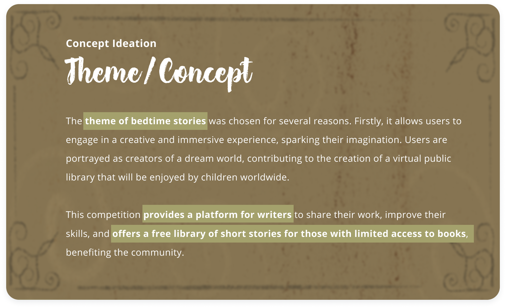
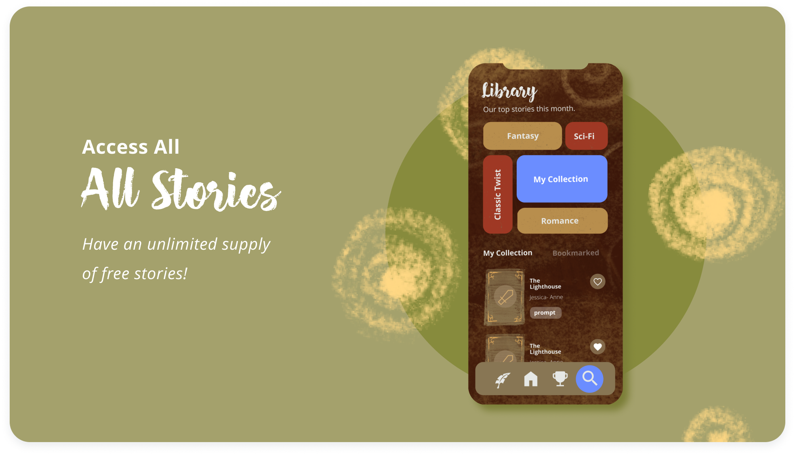

<br />


<!-- HEADER SECTION -->
<h5 align="center" style="padding:0;margin:0;">Alexa Pettitt</h5>
<h5 align="center" style="padding:0;margin:0;">21100290</h5>
<h6 align="center">DV300 | 2023</h6>
</br>
<p align="center">
  <a href="https://github.com/AlexaPea/Whimsy-ReactNative">
    
  </a>
  
  <h3 align="center">Whimsy</h3>

  <p align="center">
    A bedtime story competition Mobile application.
 <br>
      <a href="https://github.com/AlexaPea/Whimsy-ReactNative"><strong>Explore the docs »</strong></a>
   <br>
</p>


## Table of Contents
* [About The Project](#about-the-project)
  * [Project Description](#project-description)
  * [Built With](#built-with)
* [Getting Started](#getting-started)
  * [Prerequisites](#prerequisites)
  * [How To Install](#how-to-install)
* [Development Process](#development-process)
  * [Concept Process](#concept-process)
  * [Implementation Process](#implementation-process)
    * [The Functionality](#the-functionality)
    * [Above & Beyond](#above--beyond)
    * [Reviews & Testing](#reviews--testing)
    * [Challenges, Highlights & Learnings](#challenges-highlights--learnings)
    * [Future Implementation](#future-implementation)
* [Roadmap](#roadmap)
* [Contributing](#contributing)
* [Authors](#authors)
* [License](#license)
* [Contact](#contact)
* [Acknowledgements](#acknowledgements)

<br/>

## About the Project

<a href="https://github.com/AlexaPea/Whimsy-ReactNative">

</a>

### Project Description
Whimsy is a mobile app that hosts a bedtime story competition for aspiring writers. Users can choose their preferred genre and compete to see who can write the best bedtime short story. The winning story will be added to the prestigious "Dreamland Storybook," a collection of captivating short stories. Having a story featured in this book increases the chances of being discovered by publishers.

The main purpose of this competition is to provide writers with a platform to showcase their work, improve their writing skills, and gain recognition. Additionally, the app serves as a free library of enchanting short stories for those who may not have easy access to physical books, thus benefiting the community. Whimsy not only fosters creativity but also allows users to immerse themselves in a magical world, inspiring their imagination and storytelling abilities.

By participating in Whimsy, users become "creators" of the Dreamworld, contributing to the creation of new forms of life through their stories. This sense of unity and collective creation fosters a virtual public library that can be enjoyed by children all over the world.

### Built With
* [ReactNative](https://reactnative.dev/)
* [Firebase](https://firebase.google.com/)


<!-- GETTING STARTED -->
## Getting Started
The following steps and instructions will allow you to copy the project on your local machine for development, practising and testing purposes.


### How to Install
### Whimsy Installation

Here are a couple of ways to clone this repo:

1. **GitHub Desktop**
   - Open GitHub Desktop and go to `File` > `Clone Repository`.
   - Enter `https://github.com/AlexaPea/Whimsy-ReactNative.git` into the URL field and press the `Clone` button.

2. **Clone Repository via Command Line**
   - Open your terminal or command prompt.
   - Run the following command to clone the project:
     ```sh
     git clone https://github.com/AlexaPea/Whimsy-ReactNative.git
     ```
   - Open your preferred development software and select `File` > `Open...` from the menu. Choose the cloned directory and press `Open`.

3. **Install Dependencies**
   - In the command-line or terminal, navigate into the cloned directory (`Whimsy-ReactNative`).
   - Run the following command to install all required dependencies:
     ```sh
     npm install
     ```
   
4. **Running the App**
   - Once in the app directory, start the application using:
     ```sh
     npm start
     ```
   - This will compile the app, and you can run it using Expo Go app on your physical device or on an emulator by following the instructions provided in the Expo DevTools.


### Further help

For more detailed information about React Native Expo and its commands, refer to the Expo documentation.


## Concept Process
`Conceptual Process`

To kickstart the conceptual phase, I delved into the project brief, ensuring a clear and thorough understanding of the requirements and objectives.


Once I was aware of the requirements, I was able to progress to the ideation process.




<!-- DEVELOPMENT PROCESS -->
## Development Process

The `Development Process` encompasses the technical implementation and functionality in the frontend and backend of the application.

After finalizing the designs, I started the implementation phase.

I created the database structure for stories and users, which provided a foundation for implementing the required functionality.

### Implementation Process
<!-- stipulate all of the functionality you included in the project -->
<!-- This is your time to shine, explain the technical nuances of your project, how did you achieve the final outcome!-->
I utilized React Native, a free and open-source framework for mobile app development, to create this project. React Native enabled us to build the application using a single codebase, resulting in a cross-platform app.

Firebase, a comprehensive suite of backend services, was used for user authentication and storing story data. Firebase Authentication ensured secure user login and registration, while Firestore database provided a scalable and real-time storage solution.


* Utilized and implemented React Native for the frontend.
* Integrated Firebase for user authentication and data storage.
* Implemented user registration, login, and profile management features.


### The Functionality


#### User Authentication

To participate in the competition, users need to register and create an account. Whimsy integrates Firebase Authentication, enabling secure user registration, login, and password management.

#### Role Influence

Dependent on your role - whether that be user or judge, your navigation and displays will update accordingly.

#### Story Competition



Whimsy offers a captivating story competition where users can choose their preferred genre and showcase their writing skills. They can submit their short stories and compete against other participants to win recognition and the opportunity to be featured in the Dreamland Storybook.


#### Whimsy Storybook

The Whimsy Storybook is a collection of extraordinary short stories submitted by talented writers. It serves as a virtual public library, offering a wide range of captivating bedtime stories for children to enjoy.

### Above & Beyond
<!-- stipulate all of the functionality you included in the project -->
<!-- This is your time to shine, explain the technical nuances of your project, how did you achieve the final outcome!-->

* Audio player - made use of the react native audio player to add background music when using the app - this helps create an emersive user experience.
* Animations - to further the immersive experience, glow animations were added. This heightened the magical feel of the app.

### Reviews & Testing
In order to test the application I gathered a family members and writing enthusiasts to test the application - this highlighted the need for drafts and the edit feature.

### Challenges, Highlights & learnings

#### Challenges
<!-- stipulated the challenges you experienced with the project -->
Building a cross-platform mobile app with React Native posed some challenges, such as ensuring consistent UI/UX across different devices and handling platform-specific nuances. However, with careful research and testing, I was able to overcome these challenges and deliver a seamless user experience.

#### Highlights
<!-- stipulated the highlights you faced with the project and why you think you faced it or how you think you'll solve it (if not solved) -->
One of the highlights of this project was witnessing the integration of Firebase services, particularly user authentication and real-time data updates. Firebase simplified the development process and allowed us to focus on the core functionalities of Whimsy. But most of all, I believe this was the first application where I was able to create an immersive experience, which was very fufilling and resulted in me having a preference for mobile developement.


### Learnings
<!-- stipulate functionality and improvements that can be implemented in the future. -->
This project provided valuable insights into building cross-platform mobile applications using React Native and Firebase. I gained a better understanding of integrating backend services, managing user authentication, and leveraging real-time data updates.


### Future Implementation
In future, I would like to explore more above and beyond features. In addition to this, I would like to implement loaders to further enhance the user experience - potencially adding more animations and enhancing the features related to the Whimsy storybook.


## Final Outcome


## Roadmap

See the [open issues](https://github.com/AlexaPea/Whimsy-ReactNative) for a list of proposed features (and known issues).

<!-- CONTRIBUTING -->
## Contributing

Contributions are what makes the open-source community such an amazing place to learn, inspire, and create. Any contributions you make are **greatly appreciated**.

1. Fork the Project
2. Create your Feature Branch (`git checkout -b feature/AmazingFeature`)
3. Commit your Changes (`git commit -m 'Add some AmazingFeature'`)
4. Push to the Branch (`git push origin feature/AmazingFeature`)
5. Open a Pull Request

<!-- AUTHORS -->
## Authors

* **Alexa Pettitt** - [AlexaPea](https://github.com/AlexaPea/Whimsy-ReactNative)

<!-- LICENSE -->
## License

This project is protected by all rights reserved. No part of this repository may be reproduced, distributed, or transmitted in any form or by any means, without the prior written permission of the repository owner.

<!-- LICENSE -->
## Contact
* **Alexa Pettitt** - [alexapettitt14@gmail.com](mailto:alexapettitt14@gmail.com) - [@instagram_handle](https://www.instagram.com/byAlexaPettitt/) 
* **Project Link** - https://github.com/AlexaPea/Whimsy-ReactNative

<!-- ACKNOWLEDGEMENTS -->
## Acknowledgements
<!-- all resources that you used and Acknowledgements here -->
* [My Lecturer: Armand Pretorius](https://github.com/Armand-OW)
* [Stack Overflow](https://stackoverflow.com/)
* [React Native Documentation](https://reactnative.dev/)
* [Firebase Documentation](https://firebase.google.com/)

<!-- Refer to https://shields.io/ for more information and options about the shield links at the top of the ReadMe file -->
[linkedin-shield]: https://img.shields.io/badge/-LinkedIn-black.svg?style=flat-square&logo=linkedin
[linkedin-url]: https://www.linkedin.com/in/alexa-pettitt/
[instagram-shield]: https://img.shields.io/badge/-Instagram-black.svg?style=flat-square&logo=instagram
[instagram-url]: https://www.instagram.com/byAlexaPettitt/